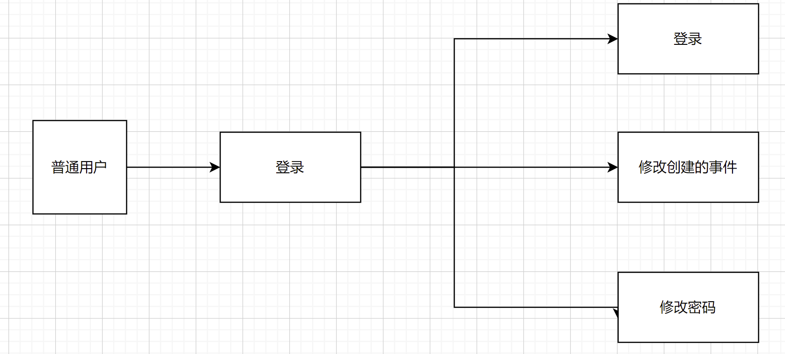
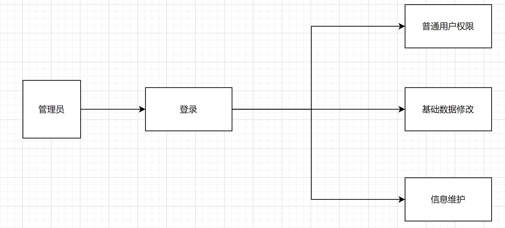

# 概要设计说明书

## 1引言

### 1.1编写目的

<!--说明编写这份概要设计说明书的目的，指出预期的读者。-->

说明对程序系统的设计考虑，包括程序系统的基本处理流程、程序系统的组织结构、模块划分、功能分配、接口设计、运行设计、安全设计、数据结构设计和出错处理设计等，为程序的详细设计 提供基础。

预期读者：软件测试员、程序开发员、软件分析员

### 1.2背景

<!--说明：-->

<!--- 待开发软件系统的名称；-->

<!--- 列出此项目的任务提出者、开发者、用户以及将运行该软件的计算站（中心）。-->

- 项目提出者：庞晓宇
- 开发者：庞晓宇、李小刚、李晨阳、陈罗星、聂嵘康
- 用户：致力于提高自己的时间利用效率，规划行动的人们

### 1.3定义

<!--列出本文件中用到的专门术语的定义和外文首字母组词的原词组。-->

- 数据结构：计算机存储、组织数据的方式。数据结构是指相互之间存在一种或多种特定关系的数据元素的集合。
- 管理员：系统的最高级权限的用户。

### 1.4参考资料

<!--列出有关的参考文件，如：-->

<!--- 本项目的经核准的计划任务书或合同，上级机关的批文；-->

<!--- 属于本项目的其他已发表文件；-->

<!--- 本文件中各处引用的文件、资料，包括所要用到的软件开发标准。列出这些文件的标题、文件编号、发表日期和出版单位，说明能够得到这些文件资料的来源。-->

- 软件开发标准：《国家标准软件开发文档模板GB856T-88》
- 《Software Engineering》(4th Edition) -- Shari L. fleeger Joanne M. Atlee

## 2总体设计

### 2.1需求规定

本系统输入用户的基本信息，和所有用户创建的事件或事件组标识，开始，结束，提醒时间，描述，详情，附件，计时，大事，打卡.   用户可以对所有用户创建的事件进行修改，并且管理员有管理整个系统的权限。同时由于使用频率和信息的隐私性，所以该系统需要严格注意系统的可靠性，安全性，具有定期数据备份功能，防止各种不可抗力对数据的破坏，要求用户使用强密码。

<!-- 说明对本系统的主要的输入输出项目、处理的功能性能要求，详细的说明可参见附录C。 -->

### 2.2运行环境

操作系统：window7及其以上版本的操作系统

<!-- 简要地说明对本系统的运行环境（包括硬件环境和支持环境）的规定，详细说明参见附录C。 -->

### 2.3基本设计概念和处理流程

<!-- 说明本系统的基本设计概念和处理流程，尽量使用图表的形式。 -->

### 2.4结构

尚无

<!-- 用一览表及框图的形式说明本系统的系统元素（各层模块、子程序、公用程序等）的划分，扼要说明每个系统元素的标识符和功能，分层次地给出各元素之间的控制与被控制关系. -->

### 2.5功能器求与程序的关系

| .         | 用户 | 管理员 |  
| --------- | ----- | ----- |  
| 基础事件创建和修改 | √     |   √      |     
| 密码修改 |    √     | √     |     
| 注册与充值 |    √    | √     |  
| 信息查询 |        |√    | 
| 账单与信息记录的查询 |       | √     |

<!-- 本条用一张如下的矩阵图说明各项功能需求的实现同各块程序的分配关系：
| .         | 程序1 | 程序2 | ……  | 程序n |
| --------- | ----- | ----- | --- | ----- |
| 功能需求1 | √     |       |     |
| 功能需求2 |       | √     |     |
| ……        |       |       |     |
| 功能需求n |       | √     |     | √     | -->

<!-- 说明在本软件系统的工作过程中不得不包含的人工处理过程（如果有的话）。 -->

### 2.6尚未问决的问题

暂无

<!-- 说明在概要设计过程中尚未解决而设计者认为在系统完成之前必须解决的各个问题。 -->

## 3接口设计

### 3.1用户接口
暂无
<!-- 说明将向用户提供的命令和它们的语法结构，以及软件的回答信息。 -->

### 3.2外部接口
暂无
<!-- 说明本系统同外界的所有接口的安排包括软件与硬件之间的接口、本系统与各支持软件之间的接口关系。 -->

### 3.3内部接口

程序内的各个模块之间采用函数调用、参数传递、返回值的方法进行信息传递。

<!-- 说明本系统之内的各个系统元素之间的接口的安排。 -->

## 4运行设计

### 4.1运行模块组合
系统是基于Microsoft Visual Studio、Visual Studio Code的开发工具下开发完成的，多窗口的环境下通过调试模块内实现不同窗体的链接
<!-- 说明对系统施加不同的外界运行控制时所引起的各种不同的运行模块组合，说明每种运行所历经的内部模块和支持软件。 -->

### 4.2运行控制
暂无
<!-- 说明每一种外界的运行控制的方式方法和操作步骤。 -->

### 4.3运行时间
A.  一般用户模块会经常运行，占用数据库使用时间的5/6
B.  管理用模块使用的最少，占用数据库使用时间的1/6
<!-- 说明每种运行模块组合将占用各种资源的时间。 -->

## 5系统数据结构设计

### 5.1逻辑结构设计要点
登陆界面：  
用户名：9位，数字和字符  
密码：11位，数字字符和符号
修改密码：  
旧口令:11位，只能输入数字字符和符号  
新口令:11位，只能输入数字字符和符号  
确认新口令:11位，只能输入数字字符和符号
注册：
用户名：9位，数字和字符  
qq号：10位，只能输入数字
邮箱：20位，数字字符和符号
密码：11位，数字字符和符号
确认密码：11位，数字字符和符号
学生基本信息维护：  
要查询的内容：11位，字符，数字，汉字
操作员工作记录：  
要查询的内容：11位，字符，数字，汉字
<!-- 给出本系统内所使用的每个数据结构的名称、标识符以及它们之中每个数据项、记录、文卷和系的标识、定义、长度及它们之间的层次的或表格的相互关系。 -->

### 5.2物理结构设计要点

属于数据库内部结构，在此不在多提

<!-- 给出本系统内所使用的每个数据结构中的每个数据项的存储要求，访问方法、存取单位、存取的物理关系（索引、设备、存储区域）、设计考虑和保密条件。 -->

### 5.3数据结构与程序的关系
通过在数据库内建立主外键来关联这些数据
<!-- 说明各个数据结构与访问这些数据结构的形式: -->

## 6系统出错处理设计

### 6.1出错信息
|错误类型                   |错误提示                   |  
---|---
|输入不合法                |文本框变红                |  
|用户名或者密码错误  |文本框变红                |     
|程序运行错误            |基于相应的出错提示  |   
<!-- 用一览表的方式说朗每种可能的出错或故障情况出现时，系统输出信息的形式、含意及处理方法。 -->

### 6.2补救措施

当出现自然灾害、硬盘损坏、或者病毒攻击时，进行数据恢复即可。

<!-- 说明故障出现后可能采取的变通措施，包括：
- 后备技术说明准备采用的后备技术，当原始系统数据万一丢失时启用的副本的建立和启动的技术，例如周期性地把磁盘信息记录到磁带上去就是对于磁盘媒体的一种后备技术；
- 降效技术说明准备采用的后备技术，使用另一个效率稍低的系统或方法来求得所需结果的某些部分，例如一个自动系统的降效技术可以是手工操作和数据的人工记录；
- 恢复及再启动技术说明将使用的恢复再启动技术，使软件从故障点恢复执行或使软件从头开始重新运行的方法。 -->

### 6.3系统维护设计

系统较小，没有涉及过多的模块，所以维护过程中只需要对数据库进行维护即可。

<!-- 说明为了系统维护的方便而在程序内部设计中作出的安排，包括在程序中专门安排用于系统的检查与维护的检测点和专用模块。 各个程序之间的对应关系，可采用如下的矩阵图的形式； -->
