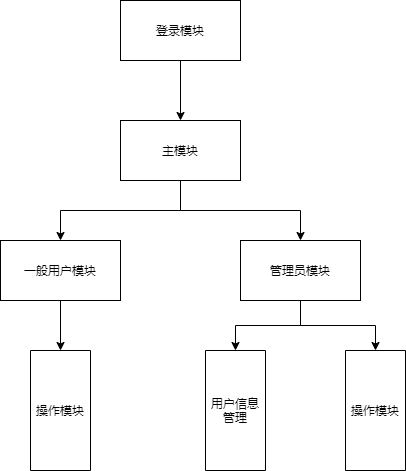

# 详细设计说明书

## 1引言

### 1.1编写目的
<!--说明编写这份详细设计说明书的目的，指出预期的读者。-->
编写详细数据说明书是为明确软件，按照需求说明书编写软件的详细设计需求，为后续软件开发人员的编码阶段做指导准备。

### 1.2背景
<!--说明：-->
<!--- 待开发软件系统的名称；-->
<!--- 本项目的任务提出者、开发者、用户和运行该程序系统的计算中心。-->
该项目旨在开发一款多功能计时器，该多功能计时器名为：。
项目相关者
- 项目提出者：庞晓宇
- 开发者：庞晓宇、李小刚、李晨阳、陈罗星、聂嵘康
- 用户：致力于提高自己的时间利用效率，规划行动的人们
- 计算中心或计算机网络：待定
- 该软件系统同其他系统或其他机构的基本的相互来往关系：暂无

### 1.3定义
<!--列出本文件中用到专门术语的定义和外文首字母组词的原词组。-->
- 数据结构：计算机存储、组织数据的方式。数据结构是指相互之间存在一种或多种特定关系的数据元素的集合。
- 管理员：系统的最高级权限的用户。

### 1.4参考资料
<!--列出有关的参考资料，如：-->
<!--- 本项目的经核准的计划任务书或合同、上级机关的批文；-->
<!--- 属于本项目的其他已发表的文件；-->
<!--- 本文件中各处引用到的文件资料，包括所要用到的软件开发标准。列出这些文件的标题、文件编号、发表日期和出版单位，说明能够取得这些文件的来源。-->
- 软件开发标准：《国家标准软件开发文档模板GB856T-88》
- 《Software Engineering》(4th Edition) -- Shari L. fleeger Joanne M. Atlee

## 2程序系统的结构
<!--用一系列图表列出本程序系统内的每个程序（包括每个模块和子程序）的名称、标识符和它们之间 的层次结构关系。-->

## 3软件设计说明
<!--从本章开始，逐个地给出各个层次中的每个程序的设计考虑。以下给出的提纲是针对一般情况的。对于一个具体的模块，尤其是层次比较低的模块或子程序，其很多条目的内容往往与它所隶属的上一层 模块的对应条目的内容相同，在这种情况下，只要简单地说明这一点即可。-->

### 3.1程序描述
<!--给出对该程序的简要描述，主要说明安排设计本程序的目的意义，并且，还要说明本程序的特点（如 是常驻内存还是非常驻？是否子程序？是可重人的还是不可重人的？有无覆盖要求？是顺序处理还是并发处理等）。-->
该程序是用于用户自行添加待办事项，打卡分享，计时器，听白噪声等多种功能，多种数据都是存贮在本地，各个功能存在子程序与接口方便后续扩展。各个功能是并发处理。比如可以在听白噪声的同时使用计时器功能。

### 3.2功能
<!--说明该程序应具有的功能，可采用IPO图（即输入一处理一输出图）的形式。-->
待办功能

白噪声功能

计时器功能

### 3.3性能
<!--说明对该程序的全部性能要求，包括对精度、灵活性和时间特性的要求。-->
软件的输入精度：保留浮点数部分  
软件的输出精度：保留浮点数部分  
传输过程中的精度:保留浮点数部分

A．运行环境的变化：该软适用于现在流行的操作系统、  
B．精度和有效时限的变化：因不同情况而变化  
C．计划的变化和改进：根据用户的需求随时软件做出更新和升级。

相应时间：0.5s内  
更新处理时间：0.5s内  
数据的更换和传送时间：1s内
### 3.4输人项
<!--给出对每一个输入项的特性，包括名称、标识、数据的类型和格式、数据值的有效范围、输入的方式。数量和频度、输入媒体、输入数据的来源和安全保密条件等等。-->
| 名称    | 标识        | 数据类型 | 长度|输入方式|
| ---------- | -------------- | ------- |----|--|
| 待办事项名 | NameText | char    |10|手动输入|
| 待办事项 | NameFullText | char    |200|手动输入|
| 事项类别| ClassName|char|20|选择输入|

### 3.5输出项
<!--给出对每一个输出项的特性，包括名称、标识、数据的类型和格式，数据值的有效范围，输出的形式、数量和频度，输出媒体、对输出图形及符号的说明、安全保密条件等等。-->
| 名称    | 标识        | 数据类型 | 长度|输入方式|
| ---------- | -------------- | ------- |----|--|
| 待办事项名 | NameText | char    |50|手动输入|
| 待办事项 | NameFullText | char    |200|手动输入|
| 用户名| UserName|char|20|手动输入|
| 事项类别| ClassName|char|20|选择输入|
| 事项建立时间| Createtime|datetime|20|自动输入|

### 3.6算法
<!--详细说明本程序所选用的算法，具体的计算公式和计算步骤。-->
对事项利用建立时间的先后顺序进行排序，方便用户浏览。

### 3.7流程逻辑
<!--用图表（例如流程图、判定表等）辅以必要的说明来表示本程序的逻辑流程。-->

### 3.8接口
<!--用图的形式说明本程序所隶属的上一层模块及隶属于本程序的下一层模块、子程序，说明参数赋值和调用方式，说明与本程序相直接关联的数据结构（数据库、数据文卷）。-->

### 3.9存储分配
<!--根据需要，说明本程序的存储分配。-->
| 名称    | 标识        | 数据类型 | 长度|
| ---------- | -------------- | ------- |----|
| 待办事项名 | NameText | char    |50|
| 待办事项 | NameFullText | char    |200|
| 用户名| UserName|char|20|
| 事项类别| ClassName|char|20|
| 事项建立时间| Createtime|datetime|20|
### 3.10注释设计
<!--说明准备在本程序中安排的注释，如：-->
<!--- 加在模块首部的注释；-->
<!--- 加在各分枝点处的注释；-->
<!--- 对各变量的功能、范围、缺省条件等所加的注释；-->
<!--- 对使用的逻辑所加的注释等等。-->
a． 在模块首部注释说明模块开始编写时间、编写人员及其基本功能  
b． 在变量声明阶段，大概说明变量的类型和用途  
c． 在判断、顺序枝分点上注释说明程序代码的功能

### 3.11限制条件
<!--说明本程序运行中所受到的限制条件。-->
必须保证程序正常的连接到服务器

### 3.12测试计划
<!--说明对本程序进行单体测试的计划，包括对测试的技术要求、输入数据、预期结果、进度安排、人员职责、设备条件驱动程序及桩模块等的规定。-->
测试用例：选取有代表性的数据，避免使用穷举法  
测试方法：使用白盒测试法，语句覆盖、判定覆盖、条件覆盖等操作。

### 3.13尚未解决的问题
<!--说明在本程序的设计中尚未解决而设计者认为在软件完成之前应解决的问题。-->
